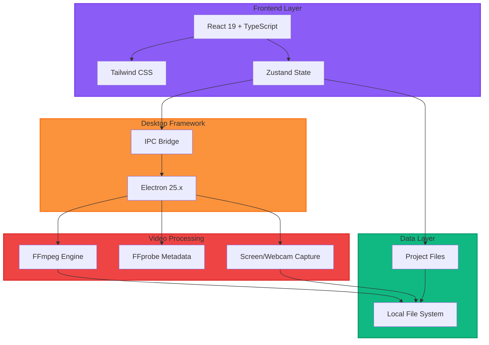

# ClipForge - Desktop Video Editor

Cross-platform desktop video editor built with Electron & React. Record screens/webcams, edit on multi-track timeline, control audio with waveform visualization, and export in multiple formats. Perfect for content creators, educators, and professionals.

## Architecture



## Features

- ✅ **Media Import**: Support for all major video formats (MP4, MOV, AVI, WebM, MKV, FLV)
- ✅ **Multi-track Timeline**: 3 video tracks and 3 audio tracks with drag-and-drop
- ✅ **Screen & Webcam Recording**: Built-in recording capabilities
- ✅ **Timeline Editing**: Trim, split, and arrange clips with real-time preview
- ✅ **Multi-clip Export**: Concatenate multiple clips seamlessly
- ✅ **Audio/Video Sync**: Proper synchronization and mixing
- ✅ **Volume Control**: Per-clip volume adjustment
- ✅ **Custom Export Presets**: 1080p, 720p, 4K, and platform-specific formats
- ✅ **Auto-save**: Automatic project saving every 2 minutes
- ✅ **Dark Theme**: Professional dark UI optimized for video editing

## Project Structure

```
clip_forge/
├── src/
│   ├── main/              # Electron main process
│   │   ├── index.ts        # Main entry point
│   │   ├── ipc/           # IPC handlers
│   │   ├── menu/          # Application menu
│   │   ├── windows/       # Window management
│   │   └── ffmpeg/        # FFmpeg operations
│   ├── renderer/          # React application
│   │   ├── components/    # UI components
│   │   │   ├── panels/    # Main panel components
│   │   │   ├── timeline/  # Timeline components
│   │   │   └── common/    # Shared components
│   │   ├── store/         # Zustand state management
│   │   ├── utils/         # Utility functions
│   │   └── styles/        # Global styles
│   └── preload/           # Preload scripts
├── public/                # Static assets
└── dist/                  # Build output
```

## Architecture

  ```mermaid
  graph TB
      subgraph UI["🎨 Frontend Layer"]
          React["React 19 + TypeScript"]
          Tailwind["Tailwind CSS"]
          Zustand["Zustand State"]
      end

      subgraph Desktop["⚡ Desktop Framework"]
          Electron["Electron 25.x"]
          IPC["IPC Bridge"]
      end

      subgraph Processing["🎬 Video Processing"]
          FFmpeg["FFmpeg Engine"]
          FFprobe["FFprobe Metadata"]
          Recorder["Screen/Webcam Capture"]
      end

      subgraph Storage["💾 Data Layer"]
          FileSystem["Local File System"]
          Projects["Project Files (.clipforge)"]
      end

      React --> Zustand
      React --> Tailwind
      Zustand --> IPC
      IPC --> Electron
      Electron --> FFmpeg
      Electron --> FFprobe
      Electron --> Recorder
      FFmpeg --> FileSystem
      Recorder --> FileSystem
      Zustand --> Projects
      Projects --> FileSystem

      style UI fill:#8b5cf6,stroke:#7c3aed,stroke-width:2px,color:#fff
      style Desktop
  fill:#fb923c,stroke:#f97316,stroke-width:2px,color:#fff
      style Processing
  fill:#ef4444,stroke:#dc2626,stroke-width:2px,color:#fff
      style Storage
  fill:#10b981,stroke:#059669,stroke-width:2px,color:#fff

  Tech Stack

  | Layer    | Technology       | Purpose                      |
  |----------|------------------|------------------------------|
  | Language | TypeScript       | Type-safe development        |
  | Desktop  | Electron 25.x    | Cross-platform runtime       |
  | Frontend | React 19 + Vite  | UI framework & build tool    |
  | Styling  | Tailwind CSS     | Utility-first styling        |
  | State    | Zustand          | Lightweight state management |
  | Video    | FFmpeg + FFprobe | Video processing & metadata  |
  | Icons    | Lucide React     | UI icons                     |
  | Build    | Electron Builder | App packaging                |

  Core Features

  - ✅ Multi-track timeline editing
  - ✅ Real-time video preview
  - ✅ Drag-and-drop interface
  - ✅ Video trimming & splitting
  - ✅ Multi-clip concatenation
  - ✅ Audio/video synchronization
  - ✅ Screen & webcam recording
  - ✅ Custom export presets (1080p, 720p, 4K)
  - ✅ Auto-save functionality
  - ✅ Cross-platform (macOS, Windows, Linux)


## Tech Stack

| Layer | Technology | Purpose |
|-------|-----------|---------|
| **Language** | TypeScript | Type-safe development |
| **Desktop** | Electron 25.x | Cross-platform runtime |
| **Frontend** | React 19 + Vite | UI framework & build tool |
| **Styling** | Tailwind CSS | Utility-first styling |
| **State** | Zustand | Lightweight state management |
| **Video** | FFmpeg + FFprobe | Video processing & metadata |
| **Icons** | Lucide React | UI icon library |
| **Build** | Electron Builder | App packaging & distribution |

## Development

### Prerequisites

- Node.js 18+
- npm or yarn
- FFmpeg (automatically installed via @ffmpeg-installer/ffmpeg)

### Installation

```bash
# Clone the repository
git clone https://github.com/LoganLiangMay/clip_forge.git
cd clip_forge

# Install dependencies
npm install
```

### Running in Development

```bash
# Start the development server (Vite + Electron)
npm run dev
```

This will:
1. Start the Vite development server for the React app
2. Launch Electron with hot reload enabled

### Building

```bash
# Build for production
npm run build

# Package for distribution
npm run dist        # All platforms
npm run dist:mac    # macOS only
npm run dist:win    # Windows only
npm run dist:linux  # Linux only
```

## Usage

1. **Import Media**: Click the Import button in the toolbar or drag files to the Media Library
2. **Add to Timeline**: Drag media from the library to timeline tracks
3. **Edit Clips**: Select clips on the timeline to adjust properties in the Properties panel
4. **Preview**: Use the preview panel to see your edits in real-time
5. **Export**: File > Export Video to render your final video

## Keyboard Shortcuts

- **Ctrl/Cmd + N**: New Project
- **Ctrl/Cmd + O**: Open Project
- **Ctrl/Cmd + S**: Save Project
- **Ctrl/Cmd + I**: Import Media
- **Ctrl/Cmd + E**: Export Video
- **Space**: Play/Pause
- **Ctrl/Cmd + Z**: Undo
- **Ctrl/Cmd + Shift + Z**: Redo

## Roadmap (Phase 2)

- AI-powered features
- Advanced effects and transitions
- Color grading tools
- Motion tracking
- Audio effects and mixing
- Plugin system

## Contributing

Contributions are welcome! Please read our contributing guidelines before submitting PRs.

## License

MIT License - see LICENSE file for details
