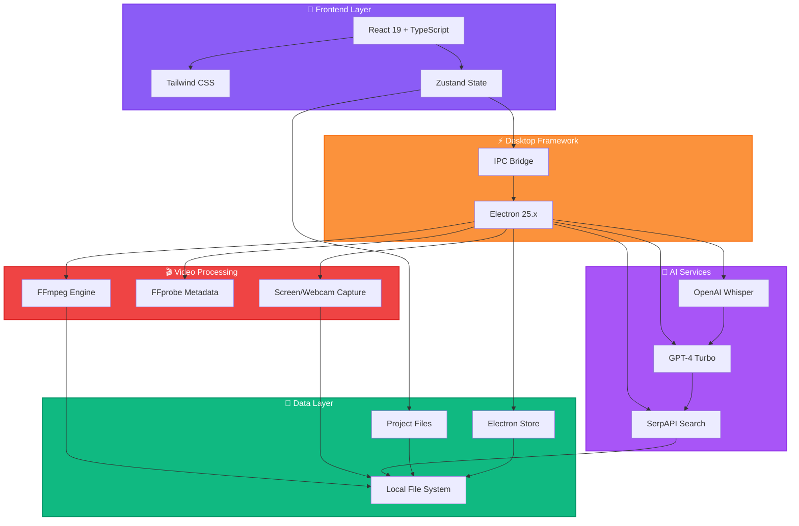

# ClipForge - AI-Powered Desktop Video Editor

A professional desktop video editor built with Electron, React 19, and FFmpeg. Features Loom-style screen/webcam recording, multi-track timeline editing, AI-powered B-roll generation, and seamless export capabilities. Perfect for content creators, educators, and video professionals.

## 🚀 Key Highlights

- 🎥 **Loom-Style Recording**: Picture-in-picture webcam overlay with draggable camera bubble
- 🤖 **AI B-roll Generation**: Auto-transcribe timeline audio with Whisper, analyze with GPT-4, and insert stock footage
- ✂️ **Professional Timeline**: Multi-track editing with magnetic snapping, split, trim, and real-time preview
- 🎬 **FFmpeg-Powered**: Industry-standard video processing for encoding and export
- ⚡ **Modern Stack**: React 19, TypeScript, Electron 25, Tailwind CSS, Zustand
- 💾 **Smart Storage**: Auto-save projects, persistent API keys, organized asset management
- ⌨️ **Keyboard Shortcuts**: Fast editing with S (split), Delete (remove), Space (play/pause)

## Architecture



## Features

### 🎥 Recording
- ✅ **Loom-Style Screen Recording**: Picture-in-picture webcam overlay with draggable positioning
- ✅ **Multi-Source Capture**: Record screen, webcam, or both simultaneously
- ✅ **Audio Recording**: Built-in microphone support with audio mixing
- ✅ **Recording Overlays**: Floating camera bubble and control overlays during capture

### ✂️ Timeline Editing
- ✅ **Multi-track Timeline**: Unlimited video and audio tracks with drag-and-drop
- ✅ **Clip Trimming**: Drag edges to trim clips with magnetic snapping
- ✅ **Split Clips**: Cut clips at playhead position (S key)
- ✅ **Magnetic Snapping**: Auto-connect adjacent clips on the same track
- ✅ **Real-time Preview**: Instant video playback with scrubbing support
- ✅ **Keyboard Shortcuts**: Space (play/pause), S (split), Delete (remove clip)
- ✅ **Timeline Zoom**: Dynamic zoom controls with fixed time markers
- ✅ **Track Controls**: Mute/unmute and lock/unlock individual tracks

### 🤖 AI-Powered Features
- ✨ **AI B-roll Finder**:
  - Analyze timeline audio with OpenAI Whisper transcription
  - Extract visual scenes with GPT-4 Turbo
  - Auto-search Pexels stock footage via SerpAPI
  - Download and auto-place clips on timeline
  - Visual distinction with purple gradient borders
  - Optional fade in/out transitions

### 📁 Media Management
- ✅ **Universal Format Support**: MP4, MOV, AVI, WebM, MKV, FLV, and more
- ✅ **Drag-and-Drop Import**: Add media from anywhere on your system
- ✅ **Media Library**: Organized view of all imported assets
- ✅ **Metadata Extraction**: Automatic duration and format detection via FFprobe

### 🎨 Export & Output
- ✅ **Custom Export Presets**: 1080p, 720p, 4K, and platform-specific formats
- ✅ **Multi-clip Concatenation**: Seamless merging of timeline clips
- ✅ **Audio/Video Sync**: Frame-accurate synchronization
- ✅ **Quality Control**: Bitrate and codec customization
- ✅ **Real-time Progress**: Visual export progress with ETA

### ⚙️ Project Management
- ✅ **Auto-save**: Automatic project saving every 2 minutes
- ✅ **Project Files**: Save/load .clipforge project files
- ✅ **Undo/Redo**: Full edit history with Ctrl+Z/Ctrl+Shift+Z
- ✅ **Settings Storage**: Persistent API keys and preferences via electron-store
- ✅ **Dark Theme**: Professional dark UI optimized for video editing

## Project Structure

```
clip_forge/
├── src/
│   ├── main/              # Electron main process
│   │   ├── index.ts        # Main entry point
│   │   ├── ipc/           # IPC handlers
│   │   ├── menu/          # Application menu
│   │   ├── windows/       # Window management
│   │   └── ffmpeg/        # FFmpeg operations
│   ├── renderer/          # React application
│   │   ├── components/    # UI components
│   │   │   ├── panels/    # Main panel components
│   │   │   ├── timeline/  # Timeline components
│   │   │   └── common/    # Shared components
│   │   ├── store/         # Zustand state management
│   │   ├── utils/         # Utility functions
│   │   └── styles/        # Global styles
│   └── preload/           # Preload scripts
├── public/                # Static assets
└── dist/                  # Build output
```

## Tech Stack

| Layer | Technology | Version | Purpose |
|-------|-----------|---------|---------|
| **Language** | TypeScript | 5.9.3 | Type-safe development |
| **Desktop** | Electron | 25.9.8 | Cross-platform runtime |
| **Frontend** | React | 19.2.0 | UI framework |
| **Build Tool** | Vite | 6.4.1 | Fast dev server & bundler |
| **Styling** | Tailwind CSS | 3.4.18 | Utility-first CSS framework |
| **State** | Zustand | 5.0.8 | Lightweight state management |
| **Video Processing** | FFmpeg | via @ffmpeg-installer | Video encoding, trimming, merging |
| **Metadata** | FFprobe | via @ffprobe-installer | Video/audio metadata extraction |
| **AI - Transcription** | OpenAI Whisper | via OpenAI API | Audio-to-text transcription |
| **AI - Analysis** | GPT-4 Turbo | via OpenAI API | Scene extraction & content analysis |
| **AI - Search** | SerpAPI | via Axios | Stock footage search (Pexels) |
| **HTTP Client** | Axios | 1.13.1 | API requests & file downloads |
| **Icons** | Lucide React | 0.548.0 | UI icon library |
| **Storage** | electron-store | 11.0.2 | Persistent settings & API keys |
| **Downloads** | electron-dl | 4.0.0 | File download management |
| **Utilities** | clsx + tailwind-merge | - | Conditional className helpers |
| **Build** | Electron Builder | 26.0.12 | App packaging & distribution |
| **Packaging** | Electron Packager | 17.1.2 | Alternative packaging tool |

## Development

### Prerequisites

- Node.js 18+
- npm or yarn
- FFmpeg (automatically installed via @ffmpeg-installer/ffmpeg)

### Installation

```bash
# Clone the repository
git clone https://github.com/LoganLiangMay/clip_forge.git
cd clip_forge

# Install dependencies
npm install
```

### Running in Development

```bash
# Start the development server (Vite + Electron)
npm run dev
```

This will:
1. Start the Vite development server for the React app
2. Launch Electron with hot reload enabled

### Building

```bash
# Build for production
npm run build

# Package for distribution
npm run dist        # All platforms
npm run dist:mac    # macOS only
npm run dist:win    # Windows only
npm run dist:linux  # Linux only
```

## Usage

1. **Import Media**: Click the Import button in the toolbar or drag files to the Media Library
2. **Add to Timeline**: Drag media from the library to timeline tracks
3. **Edit Clips**: Select clips on the timeline to adjust properties in the Properties panel
4. **Preview**: Use the preview panel to see your edits in real-time
5. **Export**: File > Export Video to render your final video

## Keyboard Shortcuts

### Project Management
- **Ctrl/Cmd + N**: New Project
- **Ctrl/Cmd + O**: Open Project
- **Ctrl/Cmd + S**: Save Project
- **Ctrl/Cmd + I**: Import Media
- **Ctrl/Cmd + E**: Export Video

### Playback
- **Space**: Play/Pause video preview
- **Click Timeline**: Seek to specific time

### Editing
- **S**: Split clip at playhead position (must select clip first)
- **Delete / Backspace**: Delete selected clip from timeline
- **Drag Clip Edges**: Trim clip start/end with magnetic snapping
- **Drag Clip Body**: Move clip to different position on track

### History
- **Ctrl/Cmd + Z**: Undo last action
- **Ctrl/Cmd + Shift + Z**: Redo action

## 🤖 AI B-roll Finder

ClipForge includes an AI-powered B-roll finder that automatically searches for and inserts relevant stock footage based on your video content. It can analyze existing timeline audio or generate from manual script input.

### Setup

1. Click the **Settings** gear icon in the toolbar
2. Add your API keys:
   - **OpenAI API Key**: Get from [platform.openai.com/api-keys](https://platform.openai.com/api-keys)
   - **SerpAPI Key**: Get from [serpapi.com/manage-api-key](https://serpapi.com/manage-api-key)

### How to Use

#### Option 1: Analyze Timeline Audio
1. Add video clips with narration/dialogue to your timeline
2. Click the **AI B-roll** button (✨ sparkle icon) in the toolbar
3. Click **"Analyze Timeline"** in the dialog
4. The AI will:
   - Extract and merge audio from all timeline clips
   - Transcribe audio using OpenAI Whisper
   - Analyze transcript with GPT-4 Turbo to identify visual scenes
   - Search and download relevant stock footage from Pexels
   - Auto-place clips on timeline with timestamps

#### Option 2: Manual Script Input
1. Click the **AI B-roll** button (✨ sparkle icon) in the toolbar
2. Enter your video script or description in the text area
3. Configure options:
   - ✅ **Prefer video clips over images**
   - ✅ **Auto-place clips on timeline (Track V2)**
   - ✅ **Add fade in/out transitions**
4. Click **Generate B-roll**

The AI will:
1. Analyze your content and extract key visual scenes with timestamps
2. Search Pexels for relevant stock footage via SerpAPI
3. Download media to your project folder (`ai-broll/`)
4. Add clips to Media Library and Timeline (if auto-place enabled)

### Features

- **OpenAI Whisper** audio transcription for timeline analysis
- **GPT-4 Turbo** content analysis for accurate scene extraction
- **Smart media search** via SerpAPI (Pexels integration)
- **Automatic downloads** to project folder with organized structure
- **Timeline insertion** with AI-suggested timestamps
- **Visual distinction**: AI clips have a purple gradient border on the timeline
- **Fade effects**: Optional fade in/out transitions
- **Dual input modes**: Analyze existing timeline or paste manual script

### Cost

- **OpenAI Whisper**: ~$0.006 per minute of audio transcribed
- **OpenAI GPT-4 Turbo**: ~$0.01-0.03 per analysis request
- **SerpAPI**: Free tier available (100 searches/month), then $50/month for 5000 searches
- **Total estimate**: ~$0.02-0.10 per AI B-roll generation (depends on audio length and scenes)

### Example Usage

**Input:**
```
A morning routine tutorial. Start with sunrise and coffee brewing,
then show healthy breakfast preparation. Include shots of exercise
and planning the day with a planner.
```

**AI Output:**
- 0:05 → sunrise/morning coffee
- 0:15 → person brewing coffee
- 0:30 → healthy meal preparation
- 0:45 → person exercising
- 1:00 → planner/organization shots

## Roadmap (Phase 2)

- Advanced effects and transitions
- Color grading tools
- Motion tracking
- Audio effects and mixing
- Plugin system

## Contributing

Contributions are welcome! Please read our contributing guidelines before submitting PRs.

## License

MIT License - see LICENSE file for details
